# CollectMind

<p align="center">
  <a href="../README.md">English</a> |
  <a href="./README.de.md">Deutsch</a> |
  <a href="./README.fr.md">Français</a> |
  <a href="./README.ja.md">日本語</a> |
  <b>Español</b> |
  <a href="./README.zh-CN.md">简体中文</a> |
  <a href="./README.zh-TW.md">繁體中文</a>
</p>

<div style="text-align: center">

</div>

CollectMind es una colección de marcadores potenciada por IA que te ayuda a construir tu propia base de conocimiento.

**Todo se ejecuta completamente en tu dispositivo.** El resumen, la recuperación de información y el chat funcionan gracias a Gemini Nano, integrado en Chrome, y a un modelo de embeddings local que se ejecuta en tu navegador — no hay servidor backend, ni clave de API, ni se requiere cuenta alguna. Tus marcadores, el contenido de las páginas y el historial de chat nunca salen de tu equipo. La única excepción deliberada es la copia de seguridad: si eliges hacer una copia de seguridad en Google Drive, los datos van directamente desde tu navegador a *tu propio* Drive — CollectMind no interviene en ningún momento ni llega a verlos.

## 1. Funciones principales
* Organiza tus marcadores por temas
* Guarda la página web actual como marcador
* Resume automáticamente el contenido de las páginas web
* (RAG) Chat con IA basado en recuperación aumentada por tema, con citas de fuentes en las que se puede hacer clic
* Chat con IA sobre una página web específica
* **Pregunta a toda tu colección a la vez** — un modo de chat "Biblioteca" que busca en todos los temas a la vez, para que no tengas que recordar en qué tema guardaste algo
* Resúmenes de temas generados automáticamente, siempre actualizados a medida que se añaden páginas
* Respuestas de IA en tiempo real (streaming)
* Copia de seguridad y restauración, ya sea en un archivo local o en tu propio Google Drive (varias copias de seguridad, puedes restaurar cualquiera de ellas)

## 2. Cómo funciona

CollectMind funciona por completo con la IA integrada de Chrome (Gemini Nano) y un pequeño modelo de embeddings local — no se envía nada a ningún servidor.

* **Resumen y chat**: las API [Summarizer](https://developer.chrome.com/docs/ai/summarizer-api) y [Prompt](https://developer.chrome.com/docs/ai/prompt-api) se encargan de los resúmenes de páginas y las respuestas conversacionales directamente en el dispositivo.
* **Recuperación (RAG)**: las páginas guardadas se dividen en fragmentos y se vectorizan localmente con [Transformers.js](https://huggingface.co/docs/transformers.js) (`Xenova/multilingual-e5-small`, que funciona bien con contenido mixto en inglés y chino), ejecutándose en un Web Worker dedicado. Al chatear, solo se recuperan los fragmentos más relevantes y se envían al modelo, en lugar de meter cada página guardada entera en el prompt, algo que antes superaba la ventana de contexto del modelo en cuanto un tema tenía más de un puñado de páginas.
* **Almacenamiento**: los temas, páginas, historial de chat y el índice de fragmentos/embeddings se guardan en IndexedDB (mediante Dexie) en tu equipo.

Puedes comprobar el estado de la indexación y reconstruir el índice de búsqueda desde **Configuración**.

## 3. Cómo compilar y ejecutar
> ⚠️ Las funciones de IA dependen de las capacidades de IA integradas en Chrome, por lo que la versión mínima requerida es **Chrome 138**, y el modelo en el dispositivo tiene requisitos de hardware reales: **22 GB o más de espacio libre en disco**, además de una GPU con **más de 4 GB de VRAM** o **16 GB o más de RAM y 4 o más núcleos de CPU**. Si una tarjeta de estado en Configuración muestra "Unavailable", abre `chrome://on-device-internals` para ver el motivo exacto (lo más habitual es falta de espacio en disco).

1. Clona este repositorio
2. ```npm install && npm run build```
3. Carga el directorio ```/dist``` en Chrome como una extensión sin empaquetar.
4. Haz clic en el icono de la extensión para abrir CollectMind.

La primera vez que resumas una página o inicies un chat, Chrome te pedirá que descargues su modelo integrado (unos pocos GB), y el modelo de embeddings (~120 MB) se descargará en segundo plano — ambos quedan en caché después y ya no requieren acceso a la red.

## 4. Capturas de pantalla

<figure style="display:inline-block; text-align:center; margin: 10px;">
  <figcaption> 1. Página de inicio </figcaption>
  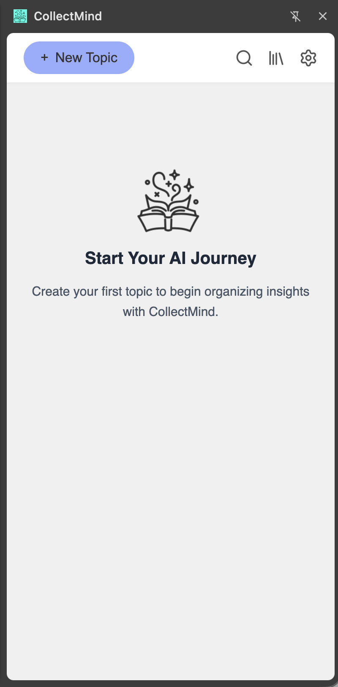
</figure>

<figure style="display:inline-block; text-align:center; margin: 10px;">
  <figcaption> 2. Crear un tema </figcaption>
  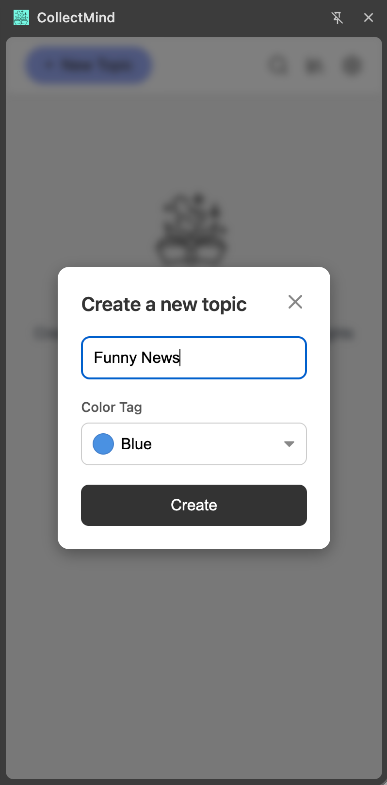
</figure>

<figure style="display:inline-block; text-align:center; margin: 10px;">
  <figcaption> 3. Lista de temas </figcaption>
  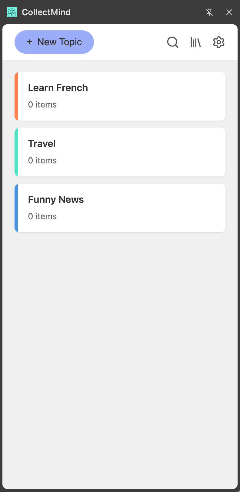
</figure>

<figure style="display:inline-block; text-align:center; margin: 10px;">
  <figcaption> 4. Lista de páginas guardadas </figcaption>
  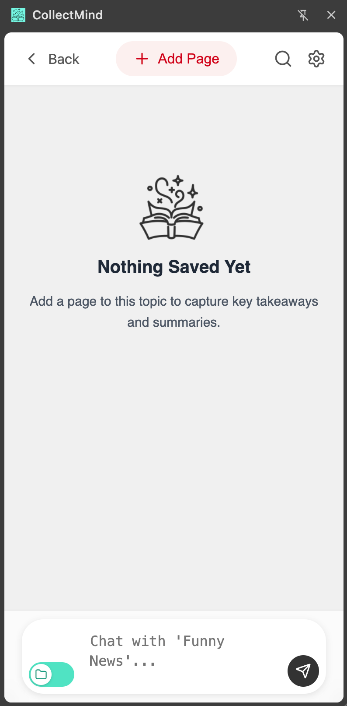
</figure>

<figure style="display:inline-block; text-align:center; margin: 10px;">
  <figcaption> 5. Resumen de página (IA) </figcaption>
  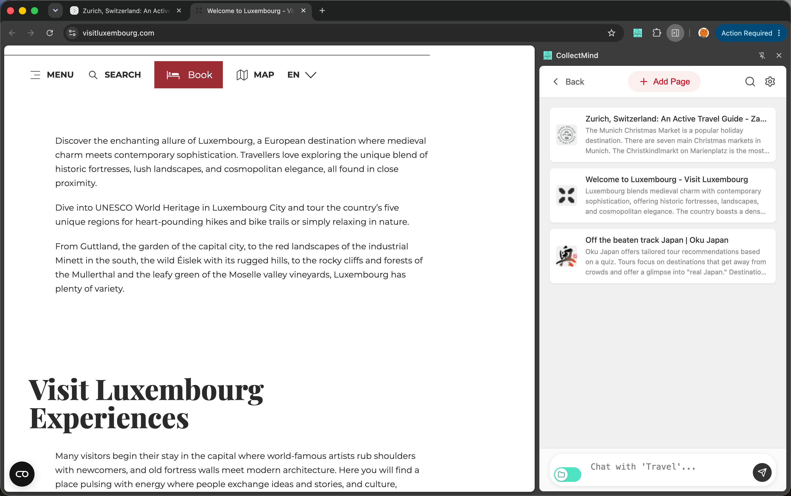
</figure>

<figure style="display:inline-block; text-align:center; margin: 10px;">
  <figcaption> 6. Detalles del resumen </figcaption>
  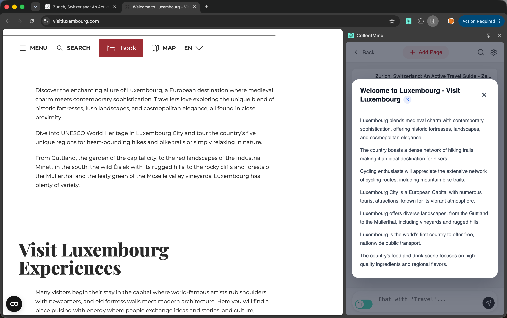
</figure>

<figure style="display:inline-block; text-align:center; margin: 10px;">
  <figcaption> 7. Chat con IA por temas </figcaption>
  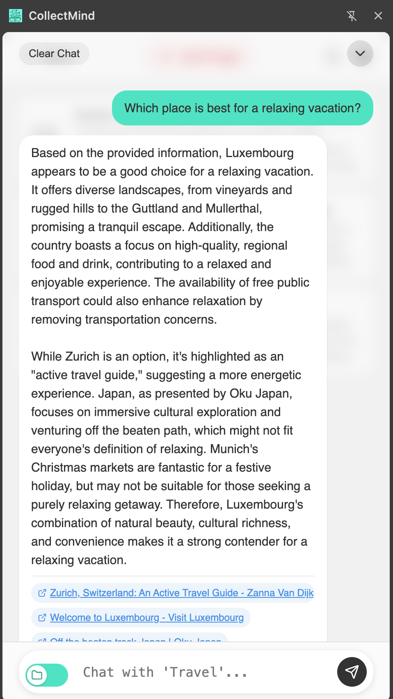
</figure>

<figure style="display:inline-block; text-align:center; margin: 10px;">
  <figcaption> 8. Chat con IA sobre una página específica </figcaption>
  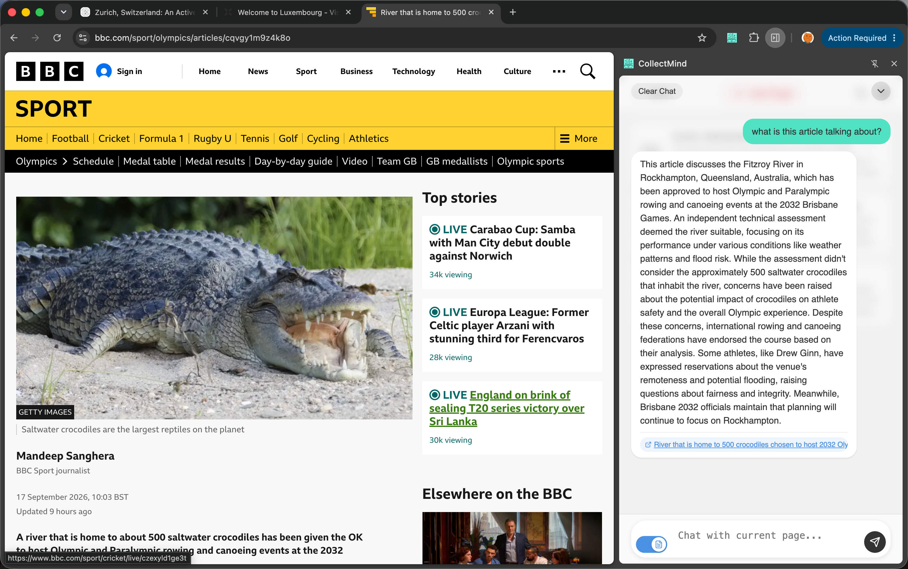
</figure>

<figure style="display:inline-block; text-align:center; margin: 10px;">
  <figcaption> 9. Preguntar a toda tu colección (todos los temas) </figcaption>
  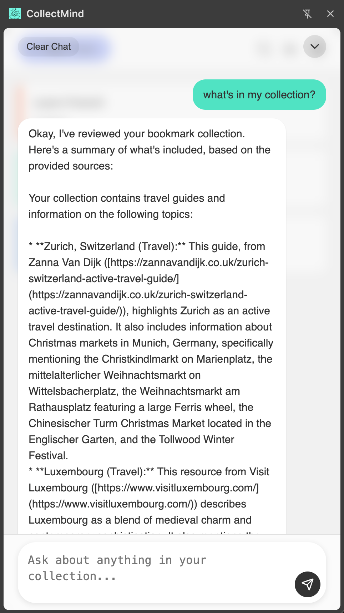
</figure>

<figure style="display:inline-block; text-align:center; margin: 10px;">
  <figcaption> 10. Configuración (modelos locales) </figcaption>
  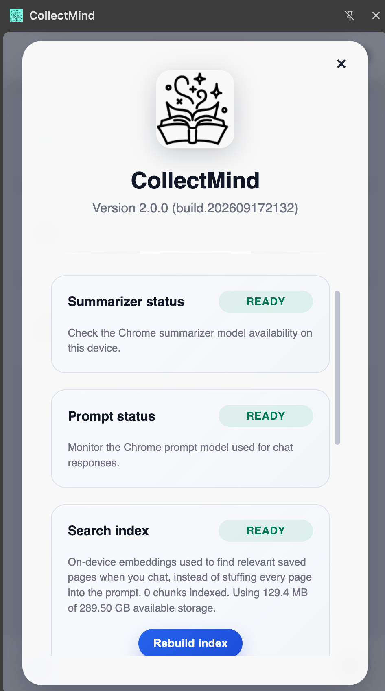
</figure>

<figure style="display:inline-block; text-align:center; margin: 10px;">
  <figcaption> 11. Configuración (copia de seguridad y nube) </figcaption>
  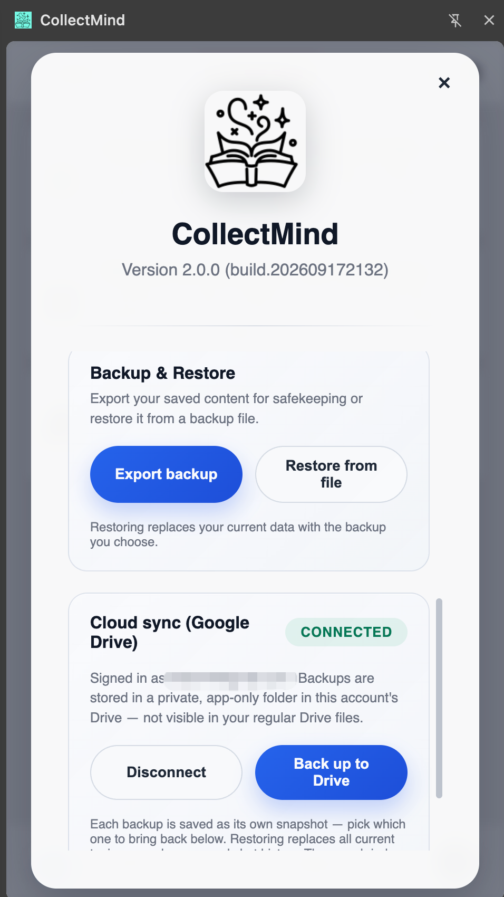
</figure>
